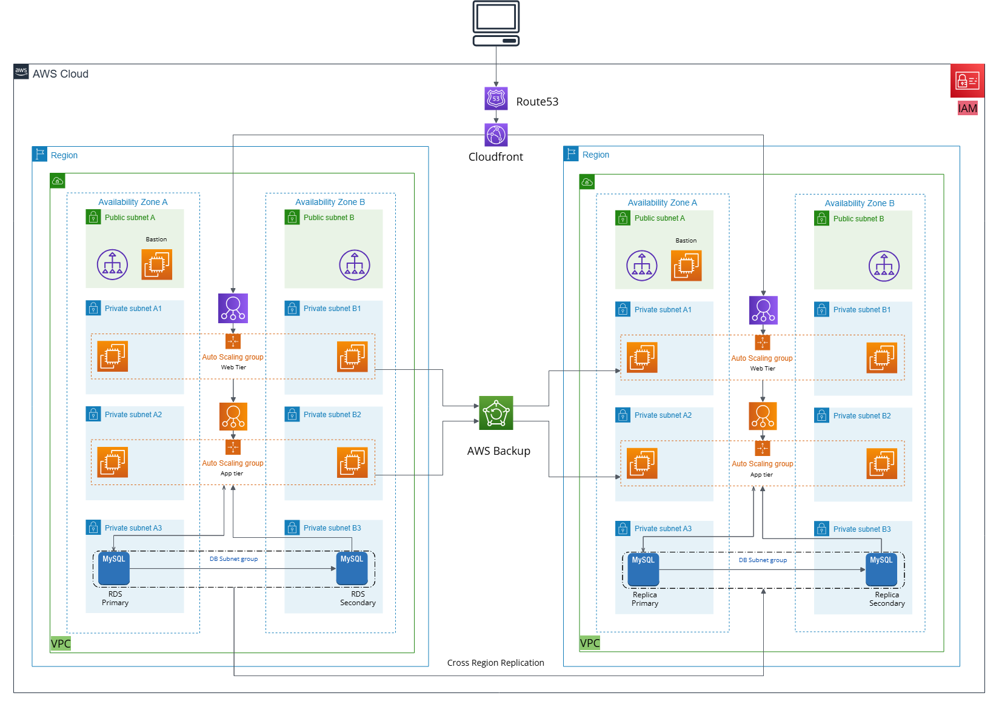

# Three-Tier Architecture on AWS

## Overview
This project implements a highly available and scalable three-tier architecture on AWS. The architecture consists of:
- **Web Tier**: Hosted on EC2 instances in private subnets.
- **App Tier**: Hosted on EC2 instances in private subnets.
- **DB Tier**: Hosted on RDS (MySQL) in private subnets.
- **Disaster Recovery**: Implemented in a secondary region using AWS Backup, CloudFront, and Route53.

## Architecture Diagram


## AWS Services Used
- **EC2**: For hosting web and app tiers.
- **VPC**: For network isolation and subnets.
- **IAM**: For role-based access control.
- **RDS (MySQL)**: For the database tier.
- **Route53**: For DNS management.
- **CloudFront**: For content delivery and disaster recovery.
- **S3**: For static assets and backups.
- **AWS Backup**: For automated backups.
- **NAT Gateway**: For outbound internet access from private subnets.
- **Bastion Host**: For secure access to private instances.

## Features
- High availability across 2 Availability Zones (AZs).
- Disaster recovery in a secondary region.
- Automated backups using AWS Backup.
- Secure access using IAM roles and Bastion Host.

## Prerequisites
- AWS Account
- Terraform (for infrastructure as code)
- AWS CLI

## Deployment
1. Clone the repository:
   ```bash
   git clone <https://github.com/gskumar-lab/3_tier_architechture.git>
